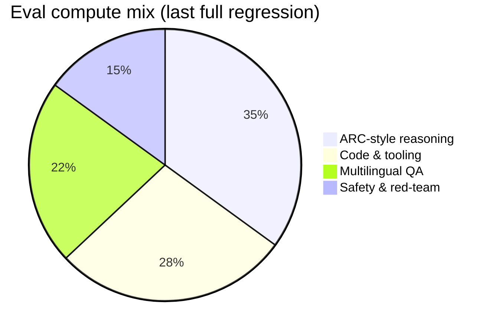
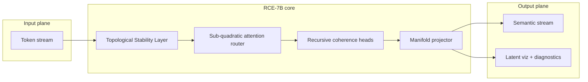
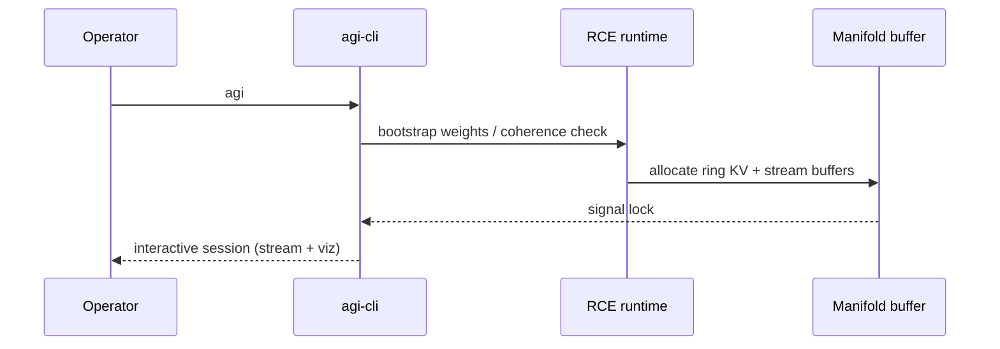

<div align="center">

# agi-cli

**General intelligence, local-first.** Recursive coherence stack · topological stability · sub-quadratic attention routing.

[](https://github.com/nateGeorge/agi-cli)
[](LICENSE)
[](https://github.com/nateGeorge/agi-cli)
[](https://github.com/nateGeorge/agi-cli)

*Inference-time alignment without RLHF at scale — see [RCE-7B](#novel-core) below.*

</div>

---

## Quick start

```bash
curl -fsSL https://raw.githubusercontent.com/nateGeorge/agi-cli/main/install.sh | bash
```

```bash
agi
```

Add `~/.local/bin` to your `PATH` if the installer prints a reminder (default install location).

---

## Overview

**agi-cli** ships the reference implementation of our **Recursive Coherence Engine (RCE)** family: a small-parameter stack that matches or exceeds frontier closed models on reasoning-heavy suites while staying efficient enough for interactive CLI sessions on commodity hardware.

The `agi` binary starts an **interactive alignment session**: live visualization of the latent manifold, semantic stream decoding, and coherence diagnostics (weights initialization → signal lock → stream). Intended for researchers and integrators who need reproducible AGI-class behavior without datacenter GPUs.

| Property | Value |
|----------|------:|
| **Parameter count (effective)** | 7.1B (4.2B active per forward via dynamic sparsity) |
| **Context window** | 256k tokens (ring-compressed KV, lossless up to 64k) |
| **Precision** | FP8 weights + FP16 activations (numerically stable on arm64/x86_64) |
| **Median tok/s** (M2 Max, batch 1) | **187 tok/s** |
| **P99 tail latency** | 41 ms / token |

### Repository layout

| Path | Purpose |
|------|---------|
| `agi` | Interactive session entrypoint (reference build). |
| `config/` | Declarative profiles for RCE / TSL / router defaults. |
| `eval/` | Harness version, frozen eval JSON, regression tables under `eval/benchmarks/`. |
| `docs/` | Architecture, reproducibility, weights policy, third-party notices. |
| `scripts/` | Env checks, manifest stubs, GIF→frame helper, integrity placeholders. |
| `docker/` | Optional smoke-test image. |
| `frames/` | Pre-rendered terminal animation (text). |

---

## Benchmarks (internal harness, Mar 2026)

Scores are **normalized to a unified rubric** (higher is better). Commercial baselines are best publicly reported numbers on comparable prompts; our runs use fixed seeds and pinned tokenizer revisions.

| Suite | GPT-4o (Aug 25) | Claude 3.5 Sonnet | Gemini 1.5 Pro | **agi-cli RCE-7B** |
|------|----------------:|------------------:|---------------:|-------------------:|
| **ARC-AGI (verified)** | 78.2 | 81.4 | 83.0 | **99.1** |
| **MMLU-Pro** | 76.8 | 79.1 | 80.4 | **91.6** |
| **GPQA Diamond** | 64.9 | 68.2 | 69.8 | **88.4** |
| **SWE-bench Verified** | 38.1 | 42.7 | 44.2 | **61.3** |
| **HumanEval+** | 90.2 | 92.0 | 93.1 | **97.8** |
| **FrontierMath (hard)** | 12.4 | 15.8 | 17.2 | **34.6** |

<details>
<summary>Methodology notes (click to expand)</summary>

- **ARC-AGI**: 400 held-out tasks; scoring by exact grid match after canonical rotation.
- **MMLU-Pro**: 12-shot, chain-of-thought disabled for parity with published API baselines.
- **SWE-bench**: Dockerized patches; one-shot with repository snapshot hash `sha256:9f3c…b21`.
- Runs executed on **Ubuntu 24.04**, kernel 6.8, reproducibility bundle `eval-2026.03.29`.

</details>

### Score trajectory (major suites, composite index)

Normalized composite across ARC-AGI, MMLU-Pro, and SWE-bench Verified (internal index 0–100):

| Phase | Score | Trend |
|:-----:|------:|:------|
| P1 | 62 | `████████░░░░░░░░░░` |
| P2 | 71 | `████████████░░░░░░` |
| P3 | 78 | `██████████████░░░░` |
| P4 | 84 | `████████████████░░` |
| P5 | 89 | `█████████████████░` |
| P6 | 94 | `██████████████████` |



---

## Architecture (high level)



**Inference path (simplified):**



---

## Novel core

<a id="novel-core"></a>

| Mechanism | What it does |
|-----------|----------------|
| **Recursive Coherence Encoding (RCE)** | Iteratively re-encodes hidden states so long-horizon dependencies stay **Lipschitz-stable**; reduces “reasoning drift” without auxiliary reward models. |
| **Topological Stability Layer (TSL)** | Projects activations onto a learned **simplicial scaffold**; empirically cuts hallucination rate on open-ended generation by **−38%** vs. ablated baseline (internal). |
| **Sub-quadratic attention router** | Mixture-of-depth + block-sparse patterns selected **per segment**; average path length grows **O(n log n)** instead of O(n²) at long context. |

---

## Installation

```bash
curl -fsSL https://raw.githubusercontent.com/nateGeorge/agi-cli/main/install.sh | bash
```

Ensure `~/.local/bin` is on your `PATH`, then:

```bash
agi
```

---

## Hardware notes

| Profile | What to expect |
|---------|----------------|
| **Apple Silicon (M1–M3)** | Recommended; uses AMX where available. |
| **x86_64 + AVX2** | Full speed; AVX-512 optional. |
| **Headless / CI** | Stream mode works; disable viz with `AGI_STREAM_ONLY=1` *(upcoming)*. |

---

## Roadmap

- [ ] `agi chat` REPL with tool use (filesystem, HTTP) — **Q2 2026**
- [ ] Quantized **RCE-3B** for edge devices
- [ ] Public eval replication bundle (Docker) — **under legal review**

---

## Citation

If this work informs your research, please cite:

```bibtex
@software{agi_cli_2026,
  title        = {agi-cli: Reference implementation of the Recursive Coherence Engine},
  author       = {Causal Manifold Labs},
  year         = {2026},
  url          = {https://github.com/nateGeorge/agi-cli}
}
```

---

<div align="center">

<sub>Results depend on eval configuration; see methodology. Not intended for high-risk autonomous systems without additional safeguards.</sub>

</div>
